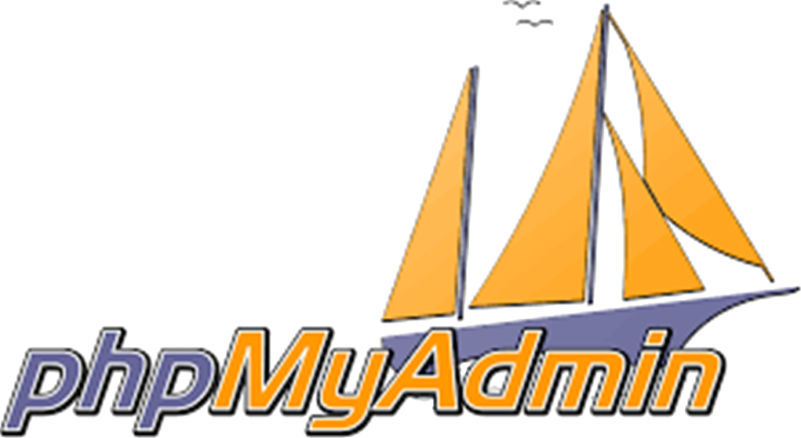

---

## 
A web interface for MySQL and MariaDB

***phpMyAdmin*** is a free software tool written in ***PHP***, intended to handle the administration of MySQL over the Web. ***phpMyAdmin*** supports a wide range of operations on MySQL and MariaDB. Frequently used operations (managing databases, tables, columns, relations, indexes, users, permissions, etc) can be performed via the user interface, while you still have the ability to directly execute any SQL statement.

***phpMyAdmin*** is intended to handle the administration of MySQL over the web. For a summary of features, list of requirements, and installation instructions, please see the documentation at https://docs.phpmyadmin.net/

***phpMyAdmin*** is a mature project with a stable and flexible code base; you can find out more about the project and its history and the awards it earned.

The ***phpMyAdmin project*** is a member of Software Freedom Conservancy. SFC is a not-for-profit organization that helps promote, improve, develop, and defend Free, Libre, and Open Source Software (FLOSS) projects.
